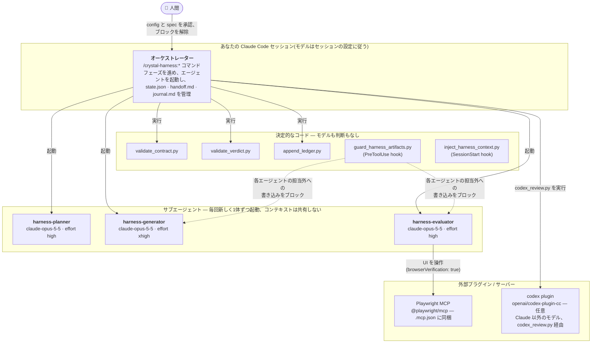
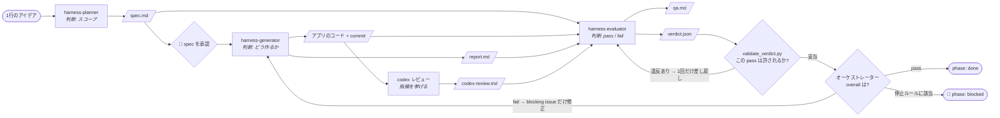
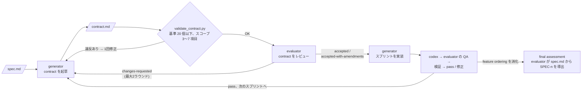

# claude-harness

[English](README.md) | 日本語

Claude Code のプラグインマーケットプレイスで、収録しているプラグインは
**[crystal-harness](crystal-harness/)** の1つです。長時間かかるアプリケーション開発向けの
マルチエージェント・ハーネスで、1行のプロダクトのアイデアから、独立した採点を通過した
アプリケーションまでを作ります。planner が仕様を書き、generator が実装し、それとは別の
evaluator が動いているアプリを実際に操作して合否を判定します。

```
/plugin marketplace add YukiTominaga/claude-harness
/plugin install crystal-harness@crystal-harness

/crystal-harness:init
/crystal-harness:plan a pomodoro timer with session history
/crystal-harness:build
```

インストール方法、設定、採点ルーブリック、検証モード、再開手順、モデルの進化に合わせて
外していく部品といった詳細は [`crystal-harness/README.ja.md`](crystal-harness/README.ja.md)(英語版は [`README.md`](crystal-harness/README.md))
にあります。このページは全体の見取り図です。

## 仕組み

誰が何をして、誰がどの成果物を読み、誰が判断するのかをまとめています。各図の詳細
(ループの各ステップ、ルーブリック、書き込み権限を強制する hook)は
[`crystal-harness/README.ja.md`](crystal-harness/README.ja.md) を参照してください。

### 登場人物



| 役割 | 動くモデル | ツール | 書くもの | 絶対にしないこと |
| --- | --- | --- | --- | --- |
| **オーケストレーター** | メインセッション(モデル固定なし) | `Agent`, `Read`, `Write`, `Bash` など | `state.json`, `handoff.md`, `journal.md`, 成果物の git commit | アプリのコードを書く、採点する、`codex-review.md` を読む・中継する |
| **harness-planner** | `claude-opus-5-5`, `high` | Read, Grep, Glob, Write, WebSearch, WebFetch | `spec.md` のみ | 雛形生成、インストール、コードを書く |
| **harness-generator** | `claude-opus-5-5`, `xhigh` | 上記 + Edit, Bash, Skill, TodoWrite | `contract.md`(草案・修正)、アプリのコードと commit、`report.md` | `qa.md`・`verdict.json`・`screenshots/`・`codex-review.md` を書く、実装後に受け入れ基準を書き換える |
| **harness-evaluator** | `claude-opus-5-5`, `high` | Read, Grep, Glob, Write, Bash, Skill, Playwright MCP — **Edit はなし** | contract のレビュー欄、`qa.md`, `verdict.json`, `screenshots/` | `.harness/` の外に書く、`codex-review.md` を書く |
| **codex レビュー** | Codex CLI 側で設定されたモデル(このプラグインでは指定しない) | — | `codex-review.md`(`codex_review.py` 経由) | ラウンドの合否を決める。あくまで判断材料であって判定ではない |

各役割が読み込む skill は、`harness-protocol`(`.harness/` を触る全員)、`sprint-contract`
(contract を書く generator とレビューする evaluator)、`qa-rubric`(evaluator)です。

### 誰が何を作り、誰がそれを使うか

デフォルトのモード(`useSprints: false`)の流れです。矢印はファイルの受け渡しで、
各エージェントのラベルはそのエージェントが判断する内容です。



`useSprints: true` にすると、各スプリントの実装の前に contract の合意が入ります。
上のループをスプリントごとに回したあと、仕様全体に対する final assessment を行います。



### 誰が何を判断するか

| 判断 | 担当 | 根拠 | 結果 |
| --- | --- | --- | --- |
| コマンド・URL・データベース | オーケストレーター(`init`)が検出し、**人間が確認** | `package.json`、lockfile、フレームワークや ORM の設定 | `config.json`。曖昧なときは推測せず質問する |
| プロダクトの範囲 | harness-planner が書き、**人間が承認** | アイデアとドメイン知識 | `spec.md`: 画面、feature ordering、やらないこと、未解決の問い |
| contract の形式が正しいか | `validate_contract.py` | 基準数の上限、スコープの項目数、ID の重複 | OK / 1回修正 / エスカレーション |
| contract はテスト可能で、作る価値があるか | harness-evaluator | `sprint-contract` の5つのレビュー観点 | `accepted` · `accepted-with-amendments` · `changes-requested` |
| どう実装するか | harness-generator | contract または spec、前回の blocking issue | コード、commit、`report.md`(完了 / 部分的 / 未着手) |
| codex の指摘は本物か | harness-evaluator | コードを読んで確認 | `qa.md` に採用・却下を記録。確認できない指摘は blocking にならない |
| そのラウンドは合格か | harness-evaluator | アプリを実際に動かす(テスト、API、データストア、有効ならブラウザ)。ルーブリックの6観点を閾値と比較 | `verdict.json`: `pass` / `fail`、スコア、再現手順と原因付きの blocking issue、`verificationMode` |
| その `pass` は許されるか | `validate_verdict.py` | スキーマ、閾値、モードごとのルール(`degraded` は絶対に pass にならない、headless は何かを実行している必要がある) | 妥当 / 1回差し戻し |
| 続けるか、修正するか、止めるか | オーケストレーター | verdict と `state.json` 内のカウンタ | 次のスプリント · blocking issue だけ修正 · `blocked`(修正回数の上限、同じ issue の3回再発、`degraded` の2回連続、ラウンド上限のいずれか) |
| ブロック後に再開するか | **人間** | `blockedReason` と直近の blocking issue | 解除(journal に記録)するか、しないか |

3つの図すべてに共通する性質が2つあります。1つは、**作ったエージェント自身が合否を
決めることはない**こと。もう1つは、**モデルが下した判断は、コードで検証できる範囲では
必ずコードで検証してから、オーケストレーターが次の行動に移る**ことです。
