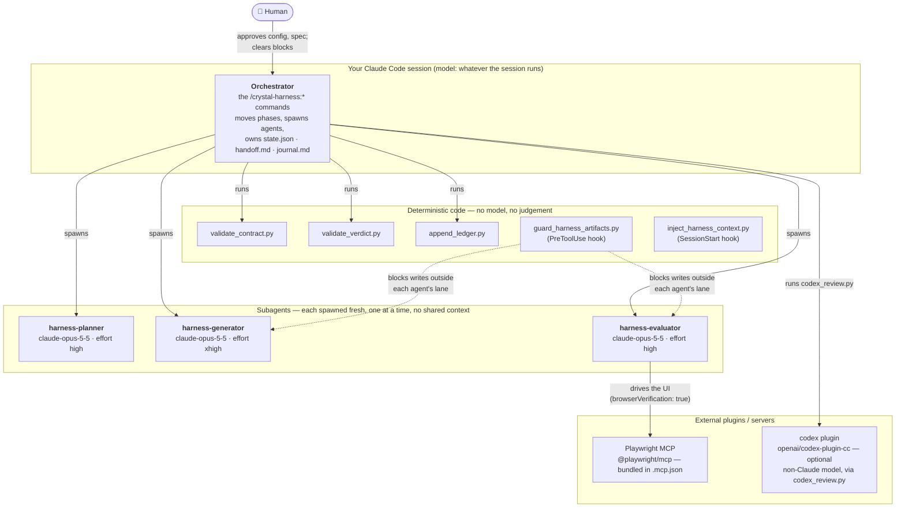
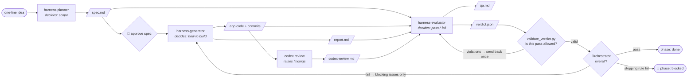
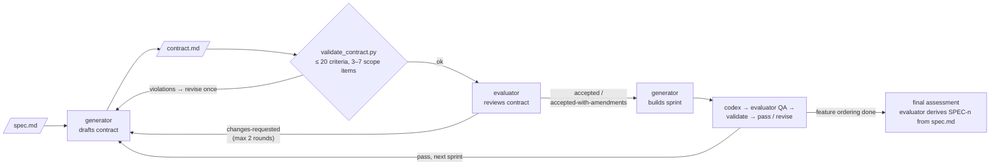

# claude-harness

English | [日本語](README.ja.md)

A Claude Code plugin marketplace hosting one plugin, **[crystal-harness](crystal-harness/)**:
a multi-agent harness for long-running application development. It turns a one-line
product idea into a built, independently graded application — a planner writes the
spec, a generator builds it, and a separate evaluator exercises the running app and
decides whether it passed.

```
/plugin marketplace add YukiTominaga/claude-harness
/plugin install crystal-harness@crystal-harness

/crystal-harness:init
/crystal-harness:plan a pomodoro timer with session history
/crystal-harness:build
```

Full documentation — install options, configuration, the rubric, verification
modes, resuming, and what to strip as models improve — is in
[`crystal-harness/README.md`](crystal-harness/README.md). This page is the map.

## How it works

Who does what, who reads whose output, and who decides. The detail behind each
diagram — the loop step by step, the rubric, the ownership hook — is in
[`crystal-harness/README.md`](crystal-harness/README.md).

### The cast



| Role | Runs on | Tools | Writes | Never |
| --- | --- | --- | --- | --- |
| **Orchestrator** | The main session (not pinned) | `Agent`, `Read`, `Write`, `Bash`, … | `state.json`, `handoff.md`, `journal.md`, git commits of artifacts | writes app code, grades, reads or relays `codex-review.md` |
| **harness-planner** | `claude-opus-5-5`, `high` | Read, Grep, Glob, Write, WebSearch, WebFetch | `spec.md` — and nothing else | scaffolds, installs, writes code |
| **harness-generator** | `claude-opus-5-5`, `xhigh` | + Edit, Bash, Skill, TodoWrite | `contract.md` (draft / revision), application code + commits, `report.md` | writes `qa.md`, `verdict.json`, `screenshots/`, `codex-review.md`; edits criteria after building |
| **harness-evaluator** | `claude-opus-5-5`, `high` | Read, Grep, Glob, Write, Bash, Skill, Playwright MCP — **no Edit** | contract review block, `qa.md`, `verdict.json`, `screenshots/` | writes anything outside `.harness/`; writes `codex-review.md` |
| **codex review** | Codex CLI's own configured model (this plugin does not choose it) | — | `codex-review.md`, via `codex_review.py` | gates a round — it is evidence, not a verdict |

Skills each role loads: `harness-protocol` (everyone who touches `.harness/`),
`sprint-contract` (generator drafting, evaluator reviewing), `qa-rubric` (evaluator).

### Who produces what, and who consumes it

The default mode (`useSprints: false`). Solid arrows are files; the label on each
agent is what it decides.



With `useSprints: true`, a contract negotiation is inserted before each build, and
the loop above runs per sprint before a final assessment over the whole spec:



### Who decides what

| Decision | Made by | Based on | Outcomes |
| --- | --- | --- | --- |
| Commands, URLs, database | Orchestrator (`init`) detects, **human confirms** | `package.json`, lockfiles, framework and ORM configs | `config.json`; ambiguity is a question, never a guess |
| What the product covers | harness-planner, **human approves** | the idea and the domain | `spec.md`: surfaces, feature ordering, non-goals, open questions |
| Is the contract well-formed | `validate_contract.py` | criterion cap, scope size, unique ids | ok / one revision / escalate |
| Is the contract testable and worth building | harness-evaluator | the `sprint-contract` five review questions | `accepted` · `accepted-with-amendments` · `changes-requested` |
| How to implement | harness-generator | contract or spec, previous blocking issues | code, commits, `report.md` (complete / partial / not attempted) |
| Is a codex finding real | harness-evaluator | reading the code | confirmed or rejected in `qa.md`; unconfirmed never blocks |
| Did the round pass | harness-evaluator | running the app: tests, API, datastore, and the browser when enabled; six rubric dimensions against thresholds | `verdict.json`: `pass` / `fail`, scores, blocking issues with repro and cause, `verificationMode` |
| Is that `pass` permitted | `validate_verdict.py` | schema, thresholds, mode rules (`degraded` never passes; headless needs something executed) | valid / sent back once |
| Continue, revise, or stop | Orchestrator | verdict + counters in `state.json` | next sprint · revise blocking issues only · `blocked` when revisions run out, an issue recurs 3×, two `degraded` rounds in a row, or the round cap is hit |
| Resume after a block | **Human** | `blockedReason` and the last blocking issues | cleared (journaled) or not |

Two properties hold across all three diagrams: **the agent that builds never
decides whether it passed**, and **every judgement a model makes is checked by code
before the orchestrator acts on it**, wherever code can check it.

